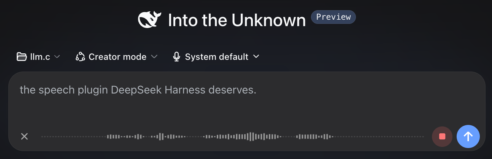
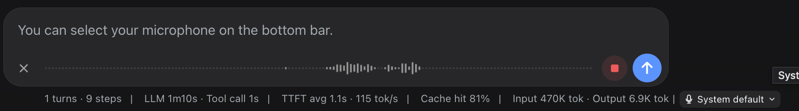
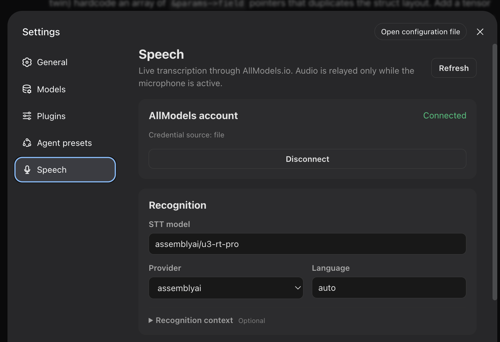
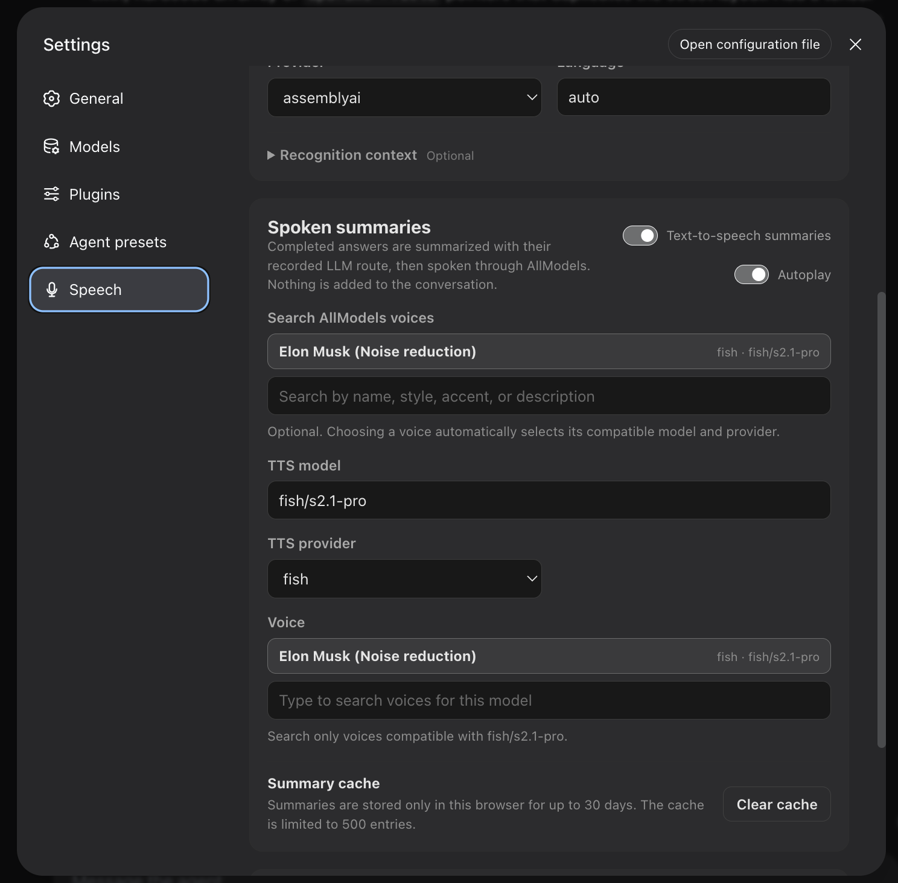

<p align="center">
  
</p>

# @allmodels/dsh-speech

**The speech plugin DeepSeek Harness deserves.**

Talk to your coding agent, see your words appear in real time, and hear a concise spoken summary when the work is done. Powered by [AllModels.io](https://allmodels.io/).

## Demo


https://github.com/user-attachments/assets/a727afab-777d-487d-a145-175f5e570eca


## Install

```sh
dsh plugin --profile web add @allmodels/dsh-speech
```

Restart DeepSeek Harness, then open **Settings → Speech**.

## Connect AllModels

Enter your email address and AllModels will send you a sign-in code. New accounts get **$1 free credit**, which should last for plenty of hours of transcription and spoken summaries.

Already have an AllModels API key? You can use that instead.

## Talk to your agent

Click the microphone next to Send and start talking. Your transcript appears as you speak, ready to edit or send.

<p align="center">
  
</p>

## Hear the summary

When the agent finishes, the plugin turns its final message into a short spoken summary. Enable autoplay to hear it immediately, or play it whenever you want.

## Settings

### Recognition

<p align="center">
  
</p>

### Spoken summaries

<p align="center">
  
</p>

## Compatibility

- DeepSeek Harness web profile `0.1.2-rc.1`
- Node.js `^22.19.0 || >=24.0.0`
- Local DeepSeek Harness web client

## Contributing

Development, testing, release, and compatibility-monitoring notes are in [CONTRIBUTING.md](./CONTRIBUTING.md).

## License

MIT
